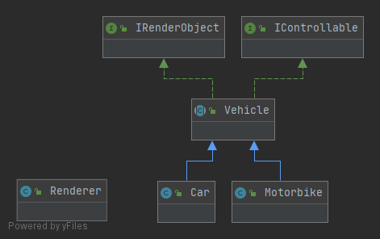

# Exercise: Car Racing Game

Develop some classes for a car racing game. Try to avoid "copy and paste".

## 1. Interfaces

a) **IRenderObject**: An Object that can be rendered to the screen.

**Methods:**

- **render(): void**
    - For this exam just print the toString return value to the console with a linebreak at the end.

b) **IControllable**: An Object that can be moved

**Methods**

- **turnLeft(degree: double): void**: Rotate to the left. Angle is measured in degree.
- **turnRight(degree: double): void**: Rotate to the right. Angle is measured in degree.
- **moveForward(distance: double): void**: Move the vehicle forward in respect to the distance and the rotation angele. The angle may either be in degree or radians, dependent on the implementation of the `sin/cos` function.
    ```
  deltaX = sin(theta) * distance
  deltaY = cos(theta) * distance
    ```
- **moveBackward(distance: double): void**: Same as `moveForward`, but in the opposite direction.


## 2. Abstract classes

a) **Vehicle**: Vehicles are controllable objects that can be drawn to the display.

A vehicle can be seen as a single point in space, that has a direction/rotation.


**protected Attributes**
- **rotation: double**: Rotation measured in degree. Allowed range: [0;360)
- **positionX: double**: X Position of the vehicle.
- **positionY: double**: Y Position of the vehicle.

**public constructors**
- **Vehicle(x: double, y: double, rotation: double)**
    - set all three attributes to the passed value

**public Methods**
- implement all methods from the `IControllable` interface.
- Override (implement) the `equals` method. Two vehicles are equal, when they have the same position (Only `x` and `y`).
- Create setters and getters for the attributes (rotation + x + y)


## 3. Classes

a) **Car**: Extends `Vehicle`.

**public constructors**
- **Car(x: double, y: double, rotation: double)**
    - call super constructor
- **Car()**
    - Set all values to 0
    
**public Methods**

- Override (implement) the toString method. Follow the following string pattern:
    ```{class_name}(x: {x_position}, y: {y_position}```
    Values inside curly brackets `{value}` need to be replaced by its actual value.
    e.g. `{class_name}` -> `Car`.
- Implement all methods from parent classes or Interfaces, that are not implemented in any parent class. (*Hint: Only one method*)

b) **Motorbike**: Extends `Vehicle`.

**private Attributes**
- **tiltAngle: double**: Current tilt angle. (Aktueller Neigungswinkel)

**public constructors**
- **Motorbike(tiltAngle: double, x: double, y: double, rotation: double)**
    - call super constructor
    - set `tiltAngle`
    
- **Car()**
    - Set all values to 0
    
**public Methods**

- Override (implement) the **toString** method. Follow the following string pattern:

    ```{class_name}(x: {x_position}, y: {y_position}```
    
    Values inside curly brackets `{value}` need to be replaced by its actual value.
    e.g. `{class_name}` -> `Car`.
- Implement all methods from parent classes or Interfaces, that are not implemented in any parent class. (*Hint: Only one method*)


c) **Renderer**: Stores all objects that can be rendered.

**private Attributes:**

- **objects: IRenderObject[]**
    - Array with all objects that can be rendered.
    - Initial size is 0.
    - May contain `null` values.

**public Methods:**

- **addRenderObject(object: IRenderObject): boolean**
    - Add the `object` to the `objects` array.
    - If the `object` is already in the array (`equals`) do nothing and return `false`.
    - If a value is `null`, this value can be replaced by `object`. Always take the last `null` value.
    - If there is no `null` value, add `object` at the end of a new array with the same content as `objects` but with one more Element.
        - (objects.length + 1 == newObjects.length)
        - Assign the new array to `objects`
    - return `true`, when the object was added to the array.
- **removeObject(object: IRenderObject): boolean**
    - Remove the `object` from the `objects` array.
    - The First element that is equal to `object` is replaced by `null`.
    - Because of the implementation of `addRenderObject` there can always be only one or zero equal objects.
    - If no object was found, do nothing.
    - return `true` when an object was found and replaced, `false` otherwise.
- **render(): void**
    - Render all objects 
    
## Class diagrams

